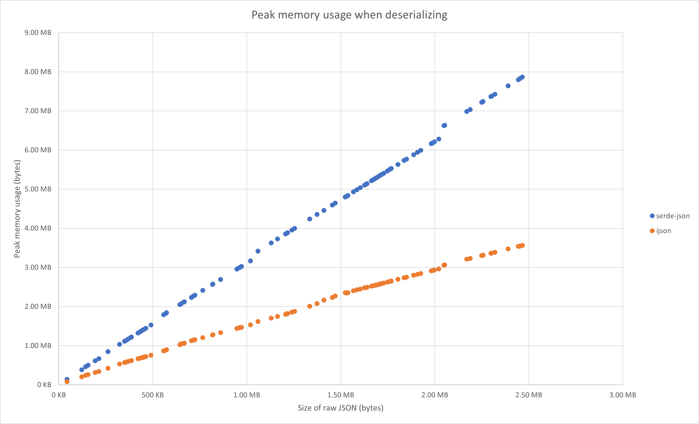
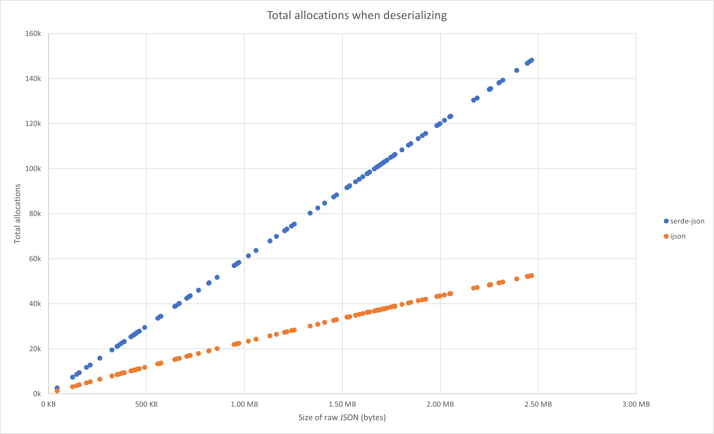
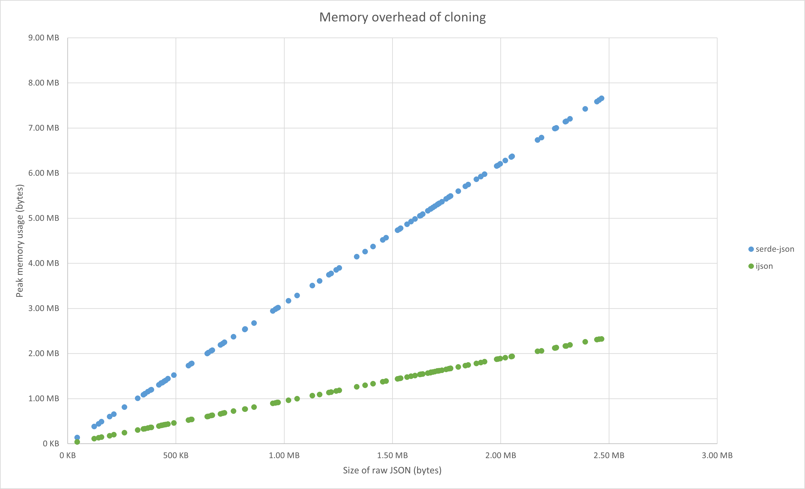

# ijson

[](https://github.com/Diggsey/ijson/actions?query=workflow%3ACI)
[](https://docs.rs/ijson)

! Warning: This crate is still a work-in-progress !

This crate offers a replacement for `serde-json`'s `Value` type, which is
significantly more memory efficient.

As a ballpark figure, it will typically use half as much memory as
`serde-json` when deserializing a value and the memory footprint of cloning
a value is more than 7x smaller.

## Memory savings

These graphs show memory savings as a function of JSON size (in bytes). The
JSON is randomly generated using the template in the `test_data` folder
using the javascript `dummyjson` tool.






You can reproduce them yourself by installing `dummy-json` from NPM, and then
running these commands in the root directory:

```
cargo run --example generate --release
cargo run --example comparison --release > comparison.csv
```

The `comparison.xlsx` Excel file uses this CSV as a data-source to generate
the graphs.

## Usage

### `IValue`

The primary type exposed by this crate is the `IValue` type. It is guaranteed
to be pointer-sized and has a niche (so `Option<IValue>` is also guaranteed
to be pointer-sized).

Compared to `serde_json::Value` this type is a struct rather than an enum, as
this is necessary to achieve the important size reductions. This means that
you cannot directly `match` on an `IValue` to determine its type.

Instead, an `IValue` offers several ways to get at the inner type:

- Destructuring using `IValue::destructure[{_ref,_mut}]()`

  These methods return wrapper enums which you _can_ directly match on, so
  these methods are the most direct replacement for matching on a `Value`.

- Borrowing using `IValue::as_{array,object,string,number}[_mut]()`

  These methods return an `Option` of the corresponding reference if the
  type matches the one expected. These methods exist for the variants
  which are not `Copy`.

- Converting using `IValue::into_{array,object,string,number}()`

  These methods return a `Result` of the corresponding type (or the
  original `IValue` if the type is not the one expected). These methods
  also exist for the variants which are not `Copy`.

- Getting using `IValue::to_{bool,{i,u,f}{32,64}}[_lossy]}()`

  These methods return an `Option` of the corresponding type. These
  methods exist for types where the return value would be `Copy`.

You can also check the type of the inner value without specifically
accessing it using one of these methods:

- Checking using `IValue::is_{null,bool,number,string,array,object,true,false}()`

  These methods exist for all types.

- Getting the type with `IValue::type_()`

  This method returns the `ValueType` enum, which has a variant for each of the
  six JSON types.

### INumber

The `INumber` type represents a JSON number. It is decoupled from any specific
representation, and internally uses several. There is no way to determine the
internal representation: instead the caller is expected to convert the number
using one of the fallible `to_xxx` functions and handle the cases where the
number does not convert to the desired type.

Special floating point values (eg. NaN, Infinity, etc.) cannot be stored within
an `INumber`.

Whilst `INumber` does not consider `2.0` and `2` to be different numbers (ie.
they will compare equal) it does allow you to distinguish them using the
method `INumber::has_decimal_point()`. That said, calling `to_i32` on
`2.0` will succeed with the value `2`.

Currently `INumber` can store any number representable with an `f64`, `i64` or
`u64`. It is expected that in the future it will be further expanded to store
integers and possibly decimals to arbitrary precision, but that is not currently
the case.

Any number representable with an `i8` or a `u8` can be stored in an `INumber`
without a heap allocation (so JSON byte arrays are relatively efficient).
Integers up to 24 bits can be stored with a 4-byte heap allocation.

### IString

The `IString` type is an interned, immutable string, and is where this crate
gets its name.

Cloning an `IString` is cheap, and it can be easily converted from `&str` or
`String` types. Comparisons between `IString`s is a simple pointer
comparison.

The memory backing an `IString` is reference counted, so that unlike many
string interning libraries, memory is not leaked as new strings are interned.
Interning uses `DashSet`, an implementation of a concurrent hash-set, allowing
many strings to be interned concurrently without becoming a bottleneck.

Given the nature of `IString` it is better to intern a string once and reuse
it, rather than continually convert from `&str` to `IString`.

### IArray

The `IArray` type is similar to a `Vec<IValue>`. The primary difference is
that the length and capacity are stored _inside_ the heap allocation, so that
the `IArray` itself can be a single pointer.

### IObject

The `IObject` type is similar to a `HashMap<IString, IValue>`. As with the
`IArray`, the length and capacity are stored _inside_ the heap allocation.
In addition, `IObject`s preserve the insertion order of their elements, in
case that is important in the original JSON.

Removing from an `IObject` will disrupt the insertion order.

## Technical details

### `IValue`

The six JSON types are broken down into those with a small fixed set of values:

- null
- bool

And those without:

- number
- string
- array
- object

Conveniently, this means we only need to distinguish between four different
heap allocated types (those without) and this can be done using only 2 bits.

We make sure our heap allocations have an alignment of at least 4 (which
is generally the case _anyway_) and this leaves us the two lower bits of
a pointer to store a "tag" value.

As an added bonus, the alignment of 4 means there are 3 constant pointer
values (other than the null pointer) which can never be returned from
`alloc`:

- 0x1
- 0x2
- 0x3

These three pointer values map neatly onto the fixed values `null`, `false`
and `true` respectively. And with that, we've covered all the possible JSON
types!

All that's left is to find a way to store numbers, strings, arrays and
objects behind a thin pointer.

### `INumber`

It's not uncommon to store byte arrays in JSON. If we need to a heap
allocation for every single byte in such an array it would be extremely
inefficient. Also, some numbers are more common than others (0, 1, -1).

As a result, we need a way to encode numbers more efficiently the smaller
they are, and ideally encode all possible byte values without a heap
allocation. But we only have a single pointer to work with, and we've
already used the tag bits!

The good news is that there just aren't that many byte values (256 to
be exact) and even if we extend the range to signed bytes too, it's
only 384. We can simply reserve a static array in our binary for these
small integers.

In practice we use a nice round 512-entry array storing values from
`-128` to `383` which more than covers the byte value range. When we
need to store one of these numbers we simply set our pointer to the
appropriate entry in the array, and skip any allocating or freeing.

### `IString`

As mentioned previously, strings are interned. As well as saving a ton
of memory when keys are repeated many times in arrays of objects, this
also makes it trivial to store a string with a single pointer, we just
set the pointer to the location of the interned string.

We also use a similar trick as for numbers to store the empty string
more cheaply: we just declare a static variable to be the empty string,
and use pointers to that.

### `IArray`

This works just like a `Vec`, but we reserve extra space at the beginning
of the allocation to store the length and capacity.

We again use the static variable optimization so that the empty `Vec` does
not require an allocation.

### `IObject`

Same idea as the `IArray` and the same static variable optimization.

Internally we actually store two arrays in the allocation: the first is
a simple array of `IValue`s and the second is the hash-table itself.
The hash table just stored indices into the first array.

This simplifies the hash table implementation whilst also allowing us to
preserve the insertion order and makes iteration very cheap (since we
don't need to skip over empty entries).

New values are always pushed onto the end of the array before their
index is inserted into the hash table. Removed values are first swapped
to the end of the array (see `Vec::swap_remove`) so that removals are
still constant time.

The hash values are not stored, since the keys (`IString`s) are interned
and so the hash function can be a very fast operation that only looks
at the pointer value.
