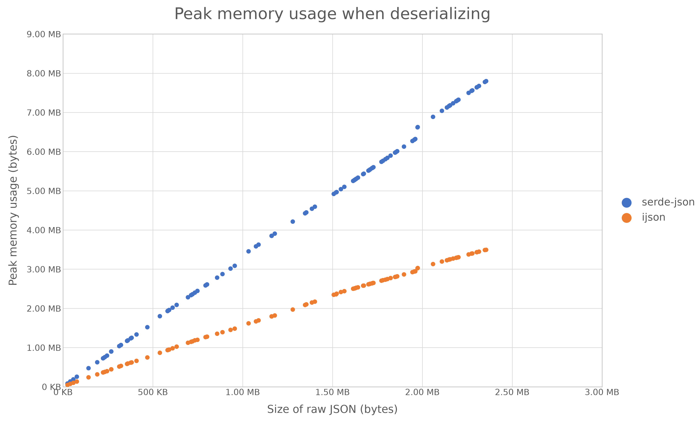
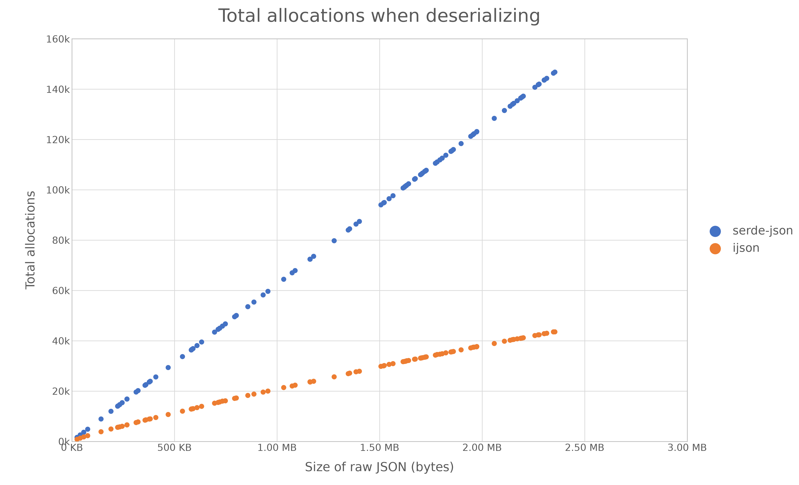
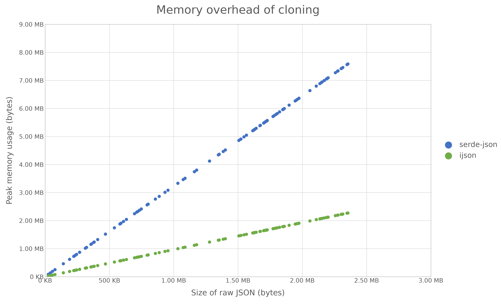
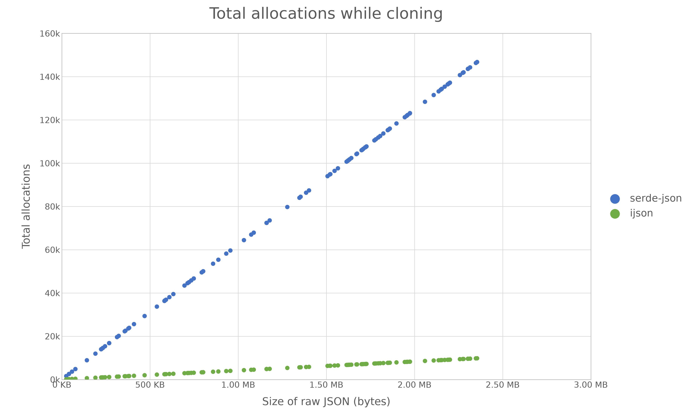

# ijson

[](https://github.com/Diggsey/ijson/actions?query=workflow%3ACI)
[](https://docs.rs/ijson)
[](https://crates.io/crates/ijson)
[](https://codecov.io/gh/Diggsey/ijson)

This crate offers a replacement for `serde-json`'s `Value` type, which is
significantly more memory efficient.

As a ballpark figure, it will typically use half as much memory as
`serde-json` when deserializing a value and the memory footprint of cloning
a value is more than 7x smaller.

## Memory savings

These graphs show memory savings as a function of JSON size (in bytes). The
JSON is randomly generated using the template in the `test_data` folder
using the javascript `dummyjson` tool.






You can reproduce them yourself by installing `dummy-json` from NPM, and then
running these commands in the root directory:

```
cargo run --example generate --release
cargo run --example comparison --release > comparison.csv
```

The `comparison.xlsx` Excel file uses this CSV as a data-source to generate
the graphs.

## Usage

### `IValue`

The primary type exposed by this crate is the `IValue` type. It is guaranteed
to be pointer-sized and has a niche (so `Option<IValue>` is also guaranteed
to be pointer-sized).

Compared to `serde_json::Value` this type is a struct rather than an enum, as
this is necessary to achieve the important size reductions. This means that
you cannot directly `match` on an `IValue` to determine its type.

Instead, an `IValue` offers several ways to get at the inner type:

- Destructuring using `IValue::destructure[{_ref,_mut}]()`

  These methods return wrapper enums which you _can_ directly match on, so
  these methods are the most direct replacement for matching on a `Value`.

- Borrowing using `IValue::as_{array,object,string,number}[_mut]()`

  These methods return an `Option` of the corresponding reference if the
  type matches the one expected. These methods exist for the variants
  which are not `Copy`.

- Converting using `IValue::into_{array,object,string,number}()`

  These methods return a `Result` of the corresponding type (or the
  original `IValue` if the type is not the one expected). These methods
  also exist for the variants which are not `Copy`.

- Getting using `IValue::to_{bool,{i,u,f}{32,64}}[_lossy]}()`

  These methods return an `Option` of the corresponding type. These
  methods exist for types where the return value would be `Copy`.

You can also check the type of the inner value without specifically
accessing it using one of these methods:

- Checking using `IValue::is_{null,bool,number,string,array,object,true,false}()`

  These methods exist for all types.

- Getting the type with `IValue::type_()`

  This method returns the `ValueType` enum, which has a variant for each of the
  six JSON types.

### INumber

The `INumber` type represents a JSON number. It is decoupled from any specific
representation, and internally uses several. There is no way to determine the
internal representation: instead the caller is expected to convert the number
using one of the fallible `to_xxx` functions and handle the cases where the
number does not convert to the desired type.

Special floating point values (eg. NaN, Infinity, etc.) cannot be stored within
an `INumber`.

Whilst `INumber` does not consider `2.0` and `2` to be different numbers (ie.
they will compare equal) it does allow you to distinguish them using the
method `INumber::has_decimal_point()`. That said, calling `to_i32` on
`2.0` will succeed with the value `2`.

By default `INumber` can store any number representable with an `f64`, `i64` or
`u64`. Enabling the `arbitrary_precision` feature stores numbers as their exact
decimal value instead, so decimals such as `0.1` are kept exactly and integers
and decimals beyond `f64`'s range and precision become representable.

Most numbers are stored _inline_ within the pointer-sized value, with no heap
allocation: small integers, timestamps and ids, and short fractions such as
`0.5` and `63.5` all fit inline (a 56-bit mantissa on 64-bit platforms, 24-bit
on 32-bit). Only larger integers and higher-precision floats fall back to a
single 8-byte heap allocation. See the technical details below.

### IString

The `IString` type is an interned, immutable string, and is where this crate
gets its name.

Cloning an `IString` is cheap, and it can be easily converted from `&str` or
`String` types. Short strings are stored inline; longer strings are interned, so
comparing two interned `IString`s is a simple pointer comparison.

The memory backing an interned `IString` is reference counted, so that unlike
many string interning libraries, memory is not leaked as new strings are
interned.
Interning uses `DashSet`, an implementation of a concurrent hash-set, allowing
many strings to be interned concurrently without becoming a bottleneck.

Given the nature of `IString` it is better to intern a string once and reuse
it, rather than continually convert from `&str` to `IString`.

### IArray

The `IArray` type is similar to a `Vec<IValue>`. The primary difference is
that the length and capacity are stored _inside_ the heap allocation, so that
the `IArray` itself can be a single pointer.

### IObject

The `IObject` type is similar to a `HashMap<IString, IValue>`. As with the
`IArray`, the length and capacity are stored _inside_ the heap allocation.
In addition, `IObject`s preserve the insertion order of their elements, in
case that is important in the original JSON.

Removing from an `IObject` will disrupt the insertion order.

## Technical details

### `IValue`

The six JSON types are broken down into those with a small fixed set of values:

- null
- bool

And those without:

- number
- string
- array
- object

We make sure our heap allocations have an alignment of at least 8, which leaves
the low three bits of a pointer free to store a "tag" value. Seven of the eight
tags name a pointer type — `i64`, `u64`, `f64`, decimal (only with
`arbitrary_precision`), string, array and object — and the eighth (tag `0`) is
the _inline_ family: rather than pointing at a heap allocation, the rest of the
word holds the value directly.

`null`, `true` and `false` are three such inline values (they need no payload at
all), as are small numbers and short strings. So the common small values cost no
allocation and no pointer indirection, and all that's left is storing larger
numbers, strings, arrays and objects behind a thin pointer.

### `INumber`

It's not uncommon to store byte arrays — or large arrays of small integers,
timestamps or ids — in JSON. A heap allocation per number would be extremely
inefficient, so small numbers are stored _inline_ in the value word (tag `0`)
rather than behind a pointer.

An inline number is a `mantissa × base^exp` value: a signed 56-bit mantissa
(24-bit on 32-bit platforms) and a small exponent, packed alongside the tag.
By default the base is 2, so an inline number is a binary float and is always
exactly an `f64`; with the `arbitrary_precision` feature the base is 10, so it
is an exact decimal. Either way the vast majority of real JSON numbers — every
small integer, and short fractions such as `0.5` — fit with no allocation.

A number that doesn't fit inline (a large integer, or a float whose exponent is
out of range) spills to a single 8-byte heap payload — an `i64`, `u64`, `f64`,
or (with `arbitrary_precision`) an arbitrary-precision decimal — whose type is
named by the tag.

### `IString`

Short strings (up to 7 bytes on 64-bit platforms, 3 on 32-bit) are stored
inline in the value word, with no allocation. Longer strings are interned:
storing one is then just a pointer to the shared interned copy, which also
saves a ton of memory when the same key is repeated many times across arrays
of objects. The empty string is a short string, so it too is inline.

### `IArray`

This works just like a `Vec`, but we reserve extra space at the beginning
of the allocation to store the length and capacity.

We again use the static variable optimization so that the empty `Vec` does
not require an allocation.

### `IObject`

Same idea as the `IArray` and the same static variable optimization.

Internally we actually store two arrays in the allocation: the first is
a simple array of `IValue`s and the second is the hash-table itself.
The hash table just stored indices into the first array.

This simplifies the hash table implementation whilst also allowing us to
preserve the insertion order and makes iteration very cheap (since we
don't need to skip over empty entries).

New values are always pushed onto the end of the array before their
index is inserted into the hash table. Removed values are first swapped
to the end of the array (see `Vec::swap_remove`) so that removals are
still constant time.

The hash values are not stored, since the keys (`IString`s) are interned
and so the hash function can be a very fast operation that only looks
at the pointer value.
